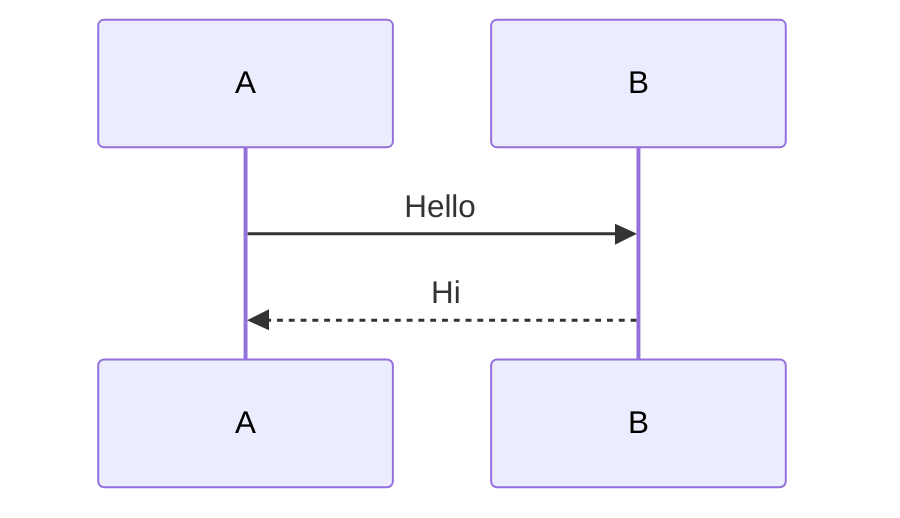

# Linux Interrupt

## ARM64 中断入口

- entry.S
  
```asm
.macro kernel_ventry, el:req, ht:req, regsize:req, label:req
 .align 7
.Lventry_start\@:
 .if \el == 0
 /*
  * This must be the first instruction of the EL0 vector entries. It is
  * skipped by the trampoline vectors, to trigger the cleanup.
  */
 b .Lskip_tramp_vectors_cleanup\@
 .if \regsize == 64
 mrs x30, tpidrro_el0
 msr tpidrro_el0, xzr
 .else
 mov x30, xzr
 .endif
.Lskip_tramp_vectors_cleanup\@:
 .endif

 sub sp, sp, #PT_REGS_SIZE
#ifdef CONFIG_VMAP_STACK
 /*
  * Test whether the SP has overflowed, without corrupting a GPR.
  * Task and IRQ stacks are aligned so that SP & (1 << THREAD_SHIFT)
  * should always be zero.
  */
 add sp, sp, x0   // sp' = sp + x0
 sub x0, sp, x0   // x0' = sp' - x0 = (sp + x0) - x0 = sp
 tbnz x0, #THREAD_SHIFT, 0f
 sub x0, sp, x0   // x0'' = sp' - x0' = (sp + x0) - sp = x0
 sub sp, sp, x0   // sp'' = sp' - x0 = (sp + x0) - x0 = sp
 b el\el\ht\()_\regsize\()_\label

0:
 /*
  * Either we've just detected an overflow, or we've taken an exception
  * while on the overflow stack. Either way, we won't return to
  * userspace, and can clobber EL0 registers to free up GPRs.
  */

 /* Stash the original SP (minus PT_REGS_SIZE) in tpidr_el0. */
 msr tpidr_el0, x0

 /* Recover the original x0 value and stash it in tpidrro_el0 */
 sub x0, sp, x0
 msr tpidrro_el0, x0

 /* Switch to the overflow stack */
 adr_this_cpu sp, overflow_stack + OVERFLOW_STACK_SIZE, x0

 /*
  * Check whether we were already on the overflow stack. This may happen
  * after panic() re-enables interrupts.
  */
 mrs x0, tpidr_el0   // sp of interrupted context
 sub x0, sp, x0   // delta with top of overflow stack
 tst x0, #~(OVERFLOW_STACK_SIZE - 1) // within range?
 b.ne __bad_stack   // no? -> bad stack pointer

 /* We were already on the overflow stack. Restore sp/x0 and carry on. */
 sub sp, sp, x0
 mrs x0, tpidrro_el0
#endif
 b el\el\ht\()_\regsize\()_\label
.org .Lventry_start\@ + 128 // Did we overflow the ventry slot?
 .endm
```

```asm
SYM_CODE_START(vectors)
 kernel_ventry 1, t, 64, sync  // Synchronous EL1t     el1t_64_sync
 kernel_ventry 1, t, 64, irq  // IRQ EL1t             el1t_64_irq
 kernel_ventry 1, t, 64, fiq  // FIQ EL1t             el1t_64_fiq
 kernel_ventry 1, t, 64, error  // Error EL1t           el1t_64_error

 kernel_ventry 1, h, 64, sync  // Synchronous EL1h     el1h_64_sync
 kernel_ventry 1, h, 64, irq  // IRQ EL1h             el1h_64_irq
 kernel_ventry 1, h, 64, fiq  // FIQ EL1h             el1h_64_fiq
 kernel_ventry 1, h, 64, error  // Error EL1h           el1h_64_error

 kernel_ventry 0, t, 64, sync  // Synchronous 64-bit EL0   el0t_64_sync
 kernel_ventry 0, t, 64, irq  // IRQ 64-bit EL0           el0t_64_irq
 kernel_ventry 0, t, 64, fiq  // FIQ 64-bit EL0           el0t_64_fiq
 kernel_ventry 0, t, 64, error  // Error 64-bit EL0         el0t_64_error

 kernel_ventry 0, t, 32, sync  // Synchronous 32-bit EL0   el0t_32_sync
 kernel_ventry 0, t, 32, irq  // IRQ 32-bit EL0           el0t_32_irq
 kernel_ventry 0, t, 32, fiq  // FIQ 32-bit EL0           el0t_32_fiq
 kernel_ventry 0, t, 32, error  // Error 32-bit EL0         el0t_32_error
SYM_CODE_END(vectors)
```

```c
struct pt_regs {
 union {
  struct user_pt_regs user_regs;
  struct {
   u64 regs[31];
   u64 sp;
   u64 pc;
   u64 pstate;
  };
 };
 u64 orig_x0;
#ifdef __AARCH64EB__
 u32 unused2;
 s32 syscallno;
#else
 s32 syscallno;
 u32 unused2;
#endif
 u64 sdei_ttbr1;
 /* Only valid when ARM64_HAS_GIC_PRIO_MASKING is enabled. */
 u64 pmr_save;
 u64 stackframe[2];

 /* Only valid for some EL1 exceptions. */
 u64 lockdep_hardirqs;
 u64 exit_rcu;
};
```

- el1t_64_irq  
EL1 Thread 模式下发生同步异常（Synchronous Exception）的兜底处理函数

通常出现于：  
内核代码访问非法地址  
执行未定义指令  
指令 abort  
数据 abort  
BUG()  
某些严重内核错误  

- el1h_64_irq

函数调用流程：



```c
asmlinkage void noinstr el1h_64_irq_handler(struct pt_regs *regs)
{
 el1_interrupt(regs, handle_arch_irq);
}

static asmlinkage void __exception_irq_entry gic_handle_irq(struct pt_regs *regs)
{
 if (unlikely(gic_supports_nmi() && !interrupts_enabled(regs)))
  __gic_handle_irq_from_irqsoff(regs);
 else
  __gic_handle_irq_from_irqson(regs);
}
```

- el0t_64_irq

- el0t_32_irq
